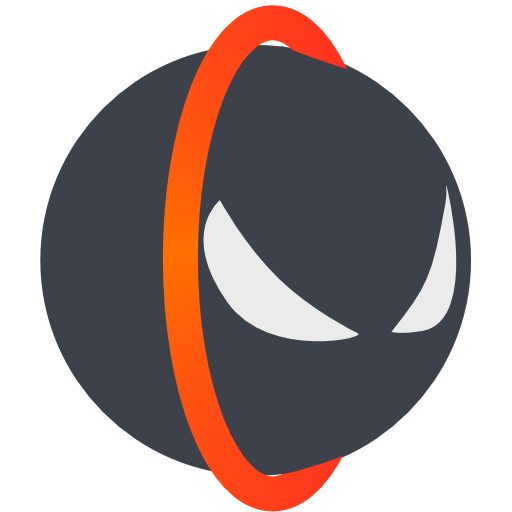

# Nyoom Launcher

Nyoom Launcher is a launcher for the game Sonic Robo Blast 2 Kart. It's pretty fun,
however, it doesn't really have an official or really unofficial launcher... So...

# So what's this?

I did this for fun, mostly, but also because I wanted a launcher that was for SRB2Kart
and not specifically SRB2. Currently, it features:
- Server favorites adding/removing so you can easily connect to servers you like.
- Basic settings for choosing executable, fullscreen, OpenGL or software, etc...
- Downloading SRB2Kart if you haven't already
- NYERRRRRRRRR!!!

# Okay, but why in Godot?
Because I can. In any case, if you want to compile your own builds of NyoomLauncher, you'll need to get [Godot Engine](https://godotengine.org/).

# Installation
Just slap the executable and packed assets anywhere, in a separate folder, in SRB2Kart's directory, and configure where your executable is. Naturally, it supports launching srb2kart-moe.

By the way, haven't tested on Linux... So keep that in mind.

# TODO
- [ ] Full Linux download support.
 - Flathub, maybe?
- [ ] Multiple themes
- [ ] Addon list saving, loading, editing, etc... 

# License
See [LICENSE](LICENSE) file for the license.

# Contact
Find me on the [Kart Krew](https://discord.gg/CgQbfSeHp9) server and we can talk about how messy my code is.
